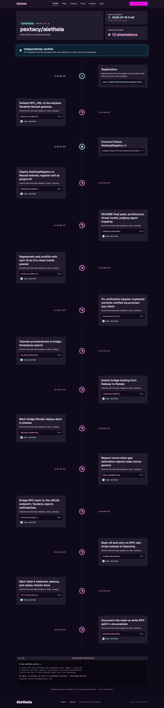
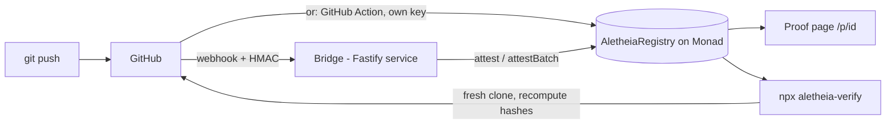
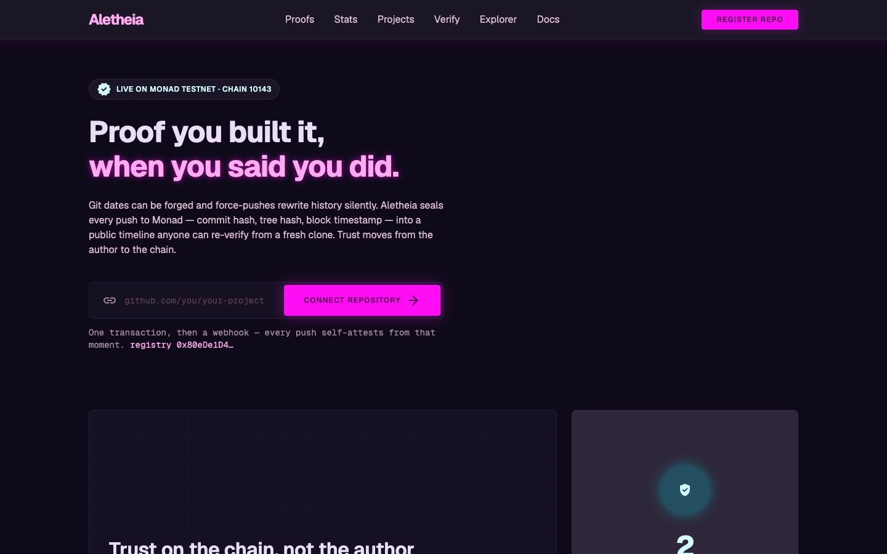
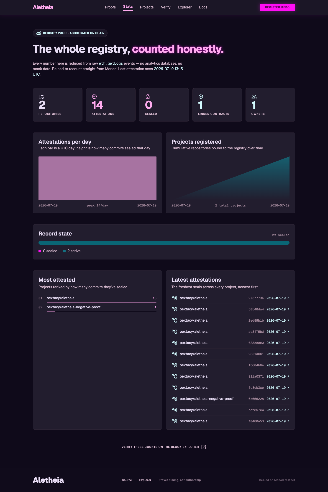

# Aletheia

**On-chain build provenance — proof you built it, when you said you did.**

Git history is author-controlled and trivially forgeable: `git commit --date` fabricates timestamps and a force-push rewrites the record silently. That leaves honest hackathon builders unable to prove they built within the rules, while judging agents fall back on fallible heuristics. Aletheia closes that gap by binding a GitHub repository to a smart contract on Monad: every push is sealed on-chain — commit hash, tree hash, block timestamp — within seconds, producing an immutable public timeline of when a project started, how it evolved commit by commit, and the moment its record was sealed for submission. An independent CLI lets anyone, human or judging agent, re-verify the entire record from a fresh clone. Trust moves from the author to the chain: Git dates can be forged; block timestamps cannot. This repository is Aletheia's own project #1 — the build you are reading was notarized by the tool it produced.

## Live deployment

| What | Where |
|---|---|
| Web (proof pages, registration, stats) | [aletheia-two-tau.vercel.app](https://aletheia-two-tau.vercel.app) — this repo's proof page: [/p/1](https://aletheia-two-tau.vercel.app/p/1) |
| `AletheiaRegistry` (Monad testnet, chain 10143) | [`0x80eDe1D4EEc7572F0a1c28e0A70bC4E4f06F1116`](https://testnet.monadexplorer.com/address/0x80eDe1D4EEc7572F0a1c28e0A70bC4E4f06F1116) — source verified (Sourcify exact match) |
| Bridge (webhook → attestation, `/verify` service) | [aletheia-bridge.onrender.com](https://aletheia-bridge.onrender.com/healthz) |
| This repo on the registry | Project **#1**, registered and attesting since deploy block `46257406`; push → on-chain measured at ~3 s |

[](https://aletheia-two-tau.vercel.app/p/1)

## How it works



Two independent ingestion paths write the same attestations:

- **Bridge path** — GitHub sends a push webhook to the bridge, which verifies the HMAC over the raw bytes, dedupes the delivery ID, resolves each commit's tree hash, and submits `attest`/`attestBatch` with a low-privilege attestor key through a serialized nonce-managed queue.
- **Trustless path** — a project adds [`.github/workflows/aletheia.yml`](.github/workflows/aletheia.yml) and its own attestor key as a repo secret; every push then attests itself from CI, and nobody has to trust Aletheia's server. This repo runs that workflow.

Verification never trusts either path: `aletheia-verify` clones the repo fresh, recomputes every commit and tree hash with local `git`, and diffs them against the chain events.

## Answering the judging agent

Each published fraud check maps to an Aletheia artifact that answers it with chain data instead of heuristics:

| Judging-agent check | Aletheia's answer |
|---|---|
| "Was the project started before the hackathon?" | First `Attested` event's **block timestamp** on the proof page — the summary strip shows the offset from the hackathon start. Attestations only ever cover the present: there is no back-attestation path, so an early start can't be hidden and a late start can't be faked. |
| "Does the demo run on static placeholder data?" | The proof page renders exclusively from live chain events (`ProjectRegistered`, `Attested`, `ContractLinked`, `Sealed`) — disable the GitHub API and it still renders. `GET /verify/:id` re-clones and re-verifies server-side, live. |
| "Does the commit history look suspicious?" | `npx aletheia-verify <id>` recomputes every hash from a fresh clone and exits non-zero on any missing or mismatched attestation. A rewritten history (force-push after attestation) surfaces as red `MISSING` rows — tamper-evidence, on demand. |

## Quickstart (3 minutes)

**1. Register your repo** — connect a wallet on the landing page and submit your GitHub repo URL, or do it with `cast` (see [Registering from the command line](#registering-a-project-from-the-command-line) below).

**2. Wire attestation** — either add the webhook the registration flow prints (bridge path), or copy [`aletheia.yml`](.github/workflows/aletheia.yml) into your repo and set `ALETHEIA_ATTESTOR_KEY` (secret) + `ALETHEIA_REGISTRY` (variable) — the trustless path.

**3. Push** — your commit appears on your proof page `/p/<projectId>` with its block timestamp within seconds.

**4. Verify (anyone):**

```bash
npx aletheia-verify <projectId> --registry 0x80eDe1D4EEc7572F0a1c28e0A70bC4E4f06F1116
```

Exit code 0 with all-green rows means every attested commit exists in the repo today with an identical tree hash.

## Threat model

**What Aletheia proves**

- A commit (and its full tree snapshot, bound by the tree hash) **existed at a specific block time** — commits can't be predated or postdated relative to the chain.
- **Timeline continuity**: the sequence of attestations is append-only; a seal freezes it permanently (every mutating function reverts after `seal`).
- **Tamper-evidence**: rewriting attested history cannot erase the chain record — verification flags the missing commits forever.

**What it deliberately does not prove (v1)**

- **Authorship or originality** — Aletheia proves *when*, not *who wrote it* or *whether it was copied*. Stated honestly in the UI.
- **Work done before the first push** — local, unpushed history is invisible until pushed.
- **Code quality or honesty of the demo itself** — only the build record.

**Trust assumptions**

- The bridge path trusts the bridge operator to attest faithfully; the GitHub Action path removes that trust. Both are constrained: the attestor key is low-privilege (attest-only, rotatable by the owner via `setAttestor`), the owner key never touches a server, and a malicious attestation of a nonexistent commit is exactly what the CLI exposes as `MISSING`/`MISMATCH`.
- Block timestamps are as trustworthy as Monad testnet consensus; reorg depth on the timescale of attestations is negligible.
- Webhook ingestion is HMAC-verified over the raw payload bytes, replay-proof by delivery ID, and rejects unregistered repos — a forged webhook cannot attest.

## Monorepo layout

| Directory | Contents |
|---|---|
| `contracts/` | `AletheiaRegistry.sol` — Solidity registry, Foundry, 30 tests |
| `bridge/` | Fastify webhook service: GitHub push → on-chain attestation; state in Neon Postgres |
| `web/` | Next.js app: landing, proof pages (`/p/[projectId]`), registry (`/projects`), repo lookup (`/verify`), stats |
| `cli/` | `aletheia-verify` — independent verification CLI (npx-runnable) |
| `docs/` | PRD, technical docs, execution plan, and the [deployment guide](docs/DEPLOY.md) |

## Develop & test

```bash
cd contracts && forge test          # 30 tests
cd bridge && npm ci && npm test     # HMAC, hash-encoding, canonicalization units
cd web && npm ci && npm run build   # typecheck + production build
cd cli && npm ci && npm run build
```

CI runs all of the above on every push (`.github/workflows/ci.yml`).

## Screenshots

| Landing | Registry stats |
|---|---|
| [](https://aletheia-two-tau.vercel.app) | [](https://aletheia-two-tau.vercel.app/stats) |

## Registering a project from the command line

The web landing page wraps these calls, but nothing about Aletheia requires it. This repository was registered as **project #1** with plain `cast`:

```bash
# repoHash = keccak256 of the lowercase canonical repo path
cast keccak "github.com/pextacy/aletheia"
# → 0xe4a131b80e2dfb2d9655fa864d4c7537e0e69bb4914f98ec8f2795588540f07a

# register (owner key signs; attestor is the bridge hot wallet)
cast send $REGISTRY_ADDRESS \
  "registerProject(bytes32,string,address)" \
  0xe4a131b80e2dfb2d9655fa864d4c7537e0e69bb4914f98ec8f2795588540f07a \
  "https://github.com/pextacy/aletheia" \
  0x89da9812e7F12538119cc58E35bFc62270dDDcFD \
  --rpc-url $RPC_URL --private-key $OWNER_PRIVATE_KEY

# attest the current HEAD manually (attestor key signs).
# Git SHA-1 ids are 20 bytes, left-aligned and zero-padded into bytes32:
COMMIT32=0x$(git rev-parse HEAD)000000000000000000000000
TREE32=0x$(git rev-parse 'HEAD^{tree}')000000000000000000000000
cast send $REGISTRY_ADDRESS \
  "attest(uint256,bytes32,bytes32)" 1 $COMMIT32 $TREE32 \
  --rpc-url $RPC_URL --private-key $ATTESTOR_PRIVATE_KEY
```

## Roadmap

Ideas deliberately out of v1 scope (see [docs/PRD.md](docs/PRD.md) §6), kept as text on purpose — nothing here is scaffolded in code:

- **Authorship/originality proof** — v1 proves timing only, and says so.
- **GitLab / Bitbucket ingestion** and **multi-repo projects**.
- **Org accounts** for hackathon organizers to pre-register cohorts.
- **NFT completion badges** minted from sealed timelines.
- **Mainnet deployment** — operationally ready today: every component is chain-parametric and [docs/DEPLOY.md §Mainnet](docs/DEPLOY.md#mainnet-chain-143--running-both-chains-together) documents running chain 143 alongside testnet; ships once the per-attestation fee economics are settled.
- **Historical back-attestation is excluded by design forever** — Aletheia only ever attests the present; that asymmetry is the product.

## License

MIT — see [LICENSE](LICENSE).
